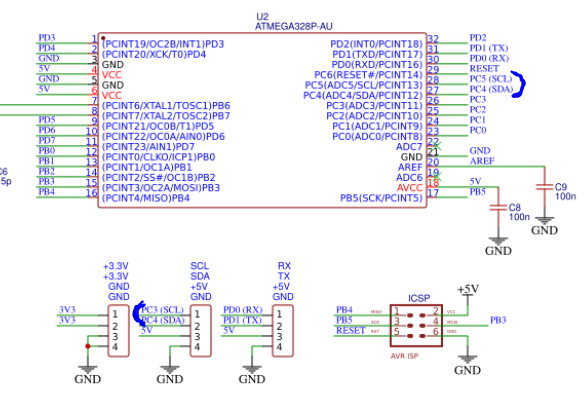
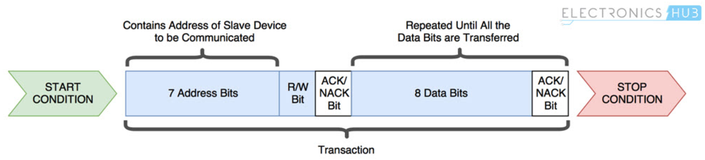

## Pre-Lab preparation

1. Use schematic of the [Arduino Uno](https://oshwlab.com/tomas.fryza/arduino-shields) board and find out on which Arduino Uno pins the SDA and SCL signals are located.

    

2. Remind yourself, what the general structure of [I2C address and data frame](https://www.electronicshub.org/basics-i2c-communication/) is.

    Data is transferred between the master device and slave devices through a single SDA data line, via patterned sequences of 0’s and 1’s (bits). Each sequence of 0’s and 1’s is termed as a transaction and the data in each transaction is structured as below:

    